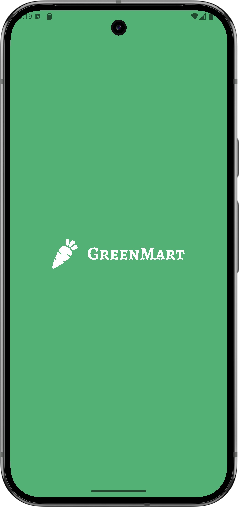
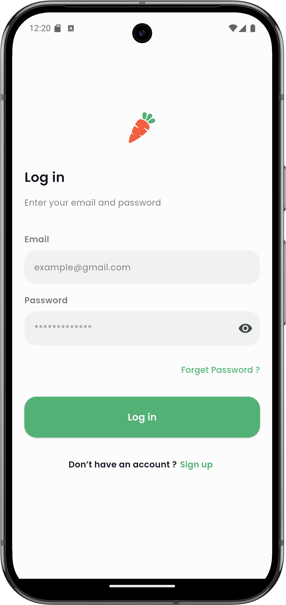
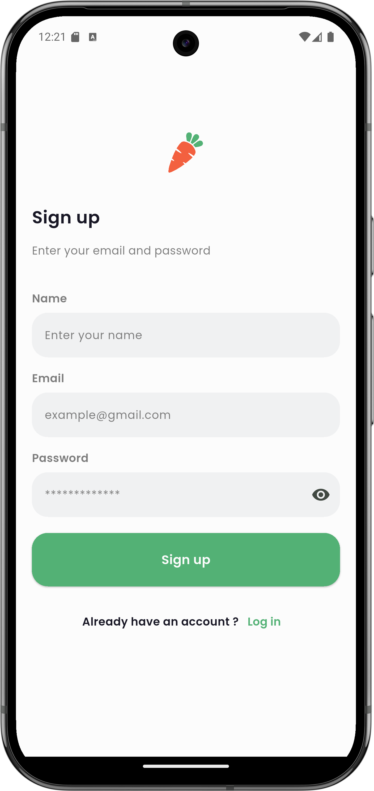
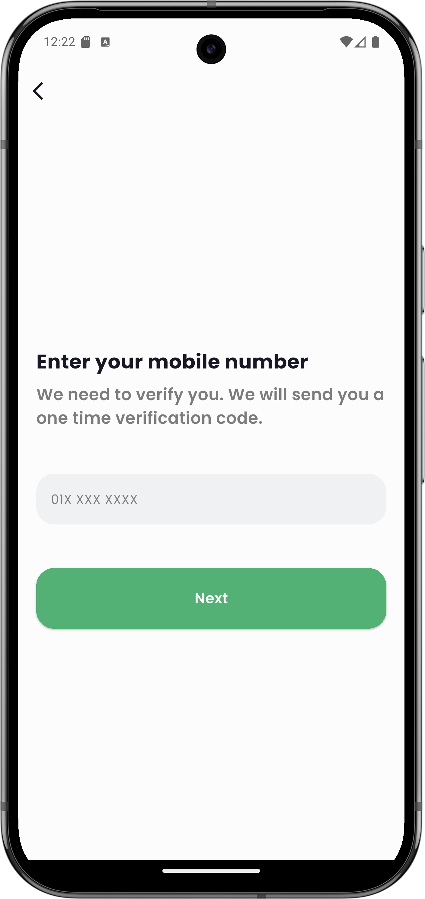
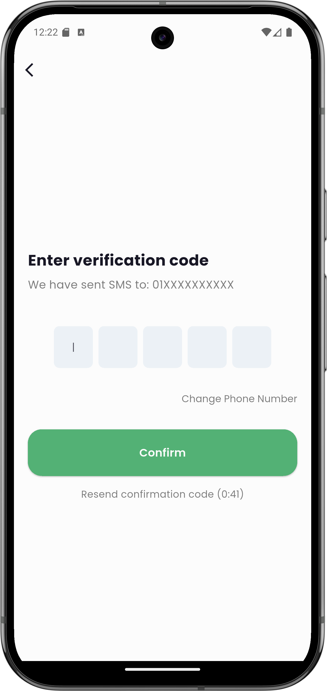

# GreenMart

A Flutter e-commerce application for fresh groceries and daily essentials. GreenMart offers a smooth shopping experience with a modern UI, product browsing, cart management, and a secure authentication flow.

---

## Screenshots

<table>
  <tr>
    <td align="center">
      <br/>
      <sub>Splash</sub>
    </td>
    <td align="center">
      <br/>
      <sub>Onboarding</sub>
    </td>
    <td align="center">
      <br/>
      <sub>Login</sub>
    </td>
  </tr>
  <tr>
    <td align="center">
      <br/>
      <sub>Sign Up</sub>
    </td>
    <td align="center">
      <br/>
      <sub>OTP</sub>
    </td>
    <td align="center">
      <br/>
      <sub>OTP Verification</sub>
    </td>
  </tr>
</table>

---

## Features

- Onboarding walkthrough for new users
- Email/phone authentication with OTP verification
- Product browsing by category (Explore)
- Search with filters
- Product detail pages
- Add to cart & favorites
- User profile management

---

## Getting Started

### Prerequisites

- [Flutter SDK](https://docs.flutter.dev/get-started/install) >= 3.0
- Dart >= 3.0
- Android Studio / Xcode for device emulators

### Run the app

```bash
flutter pub get
flutter run
```

### Build a release APK

```bash
flutter build apk --release
```

---

## Project Structure

```
lib/
 main.dart
 core/
    constants/
    functions/
    styles/
    widgets/
 features/
     auth/
     cart/
     explore/
     favorite/
     home/
     onboarding/
     product_detail/
     profile/
     search/
     splash/
```

---

## Resources

- [Flutter Documentation](https://docs.flutter.dev/)
- [Flutter Cookbook](https://docs.flutter.dev/cookbook)
